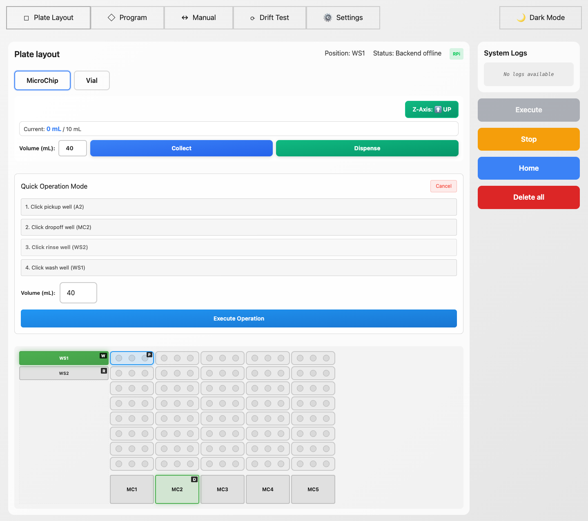
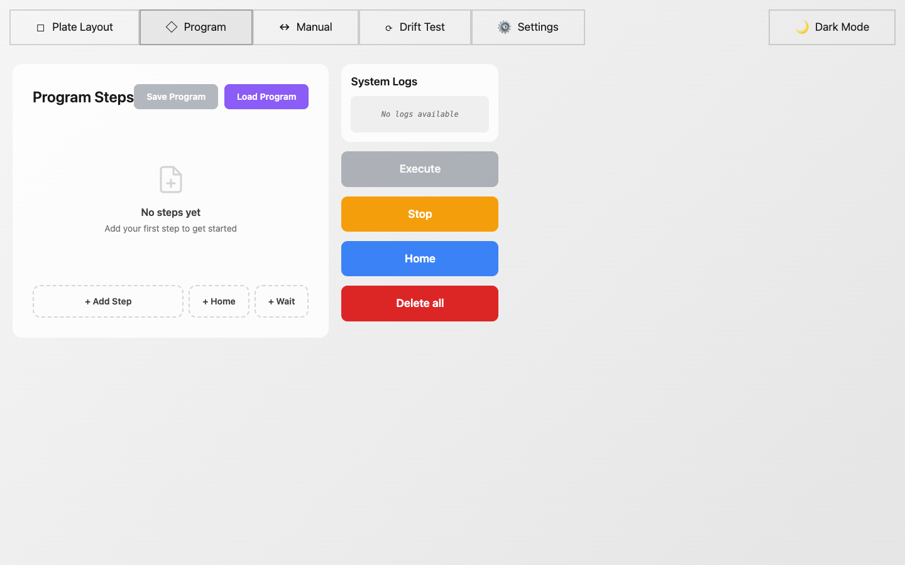
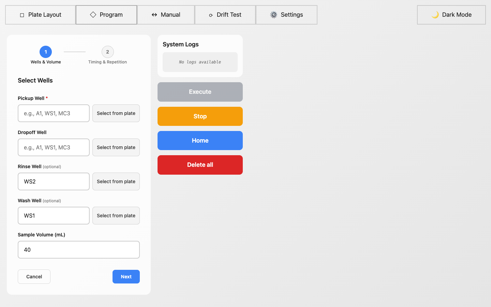
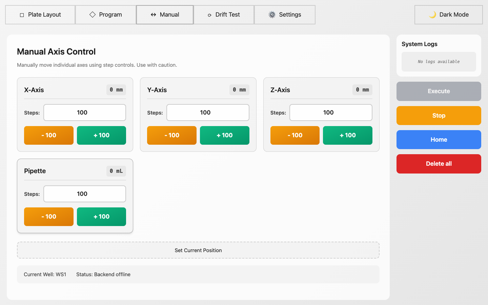
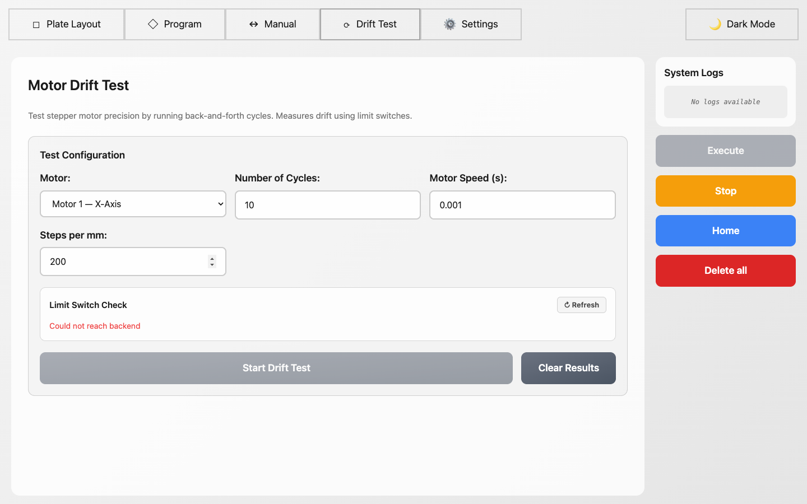
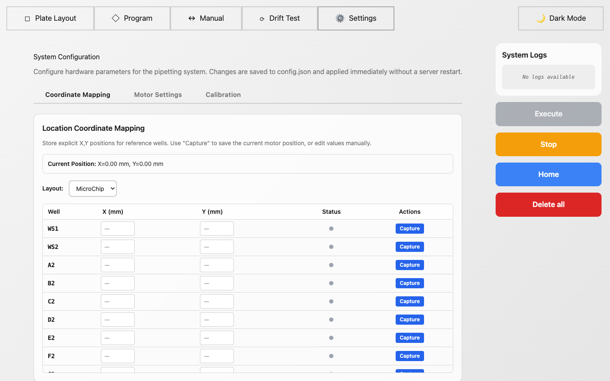

# AutoSampler - User Interface Guide

---

## Overview

AutoSampler is a laboratory pipetting automation system controlled through a web-based interface. The application allows users to manage well plates, create automated pipetting programs, manually control stepper motors, test motor precision, and configure system settings. The interface is organized into five main tabs accessible from the top navigation bar.

---

## 1. Plate Layout Tab

The **Plate Layout** tab is the main operational view of the system. From here, users can:

- **Switch between layouts**: Toggle between **MicroChip** and **Vial** layout modes using the buttons at the top left. The MicroChip layout shows an 8x15 well grid (rows A-H, columns 1-15) with 5 MicroChip slots (MC1-MC5). The Vial layout shows large vials and a smaller well grid.

- **View system status**: The top bar displays the current pipette position (e.g., "Position: WS1"), system connection status, and controller type (RPi badge).

- **Control the Z-Axis**: The Z-Axis button toggles the pipette arm up or down. The button shows the current state (UP/DOWN).

- **Collect and Dispense**: Enter a volume in mL (default: 40 mL) and use the **Collect** (aspirate) or **Dispense** buttons to operate the pipette. The progress bar shows the current pipette volume.

- **Select wells**: Click any well on the plate grid to select it as a target. Washing stations (WS1, WS2) are shown on the left side. MicroChip slots (MC1-MC5) are shown at the bottom.

- **Action buttons** (right panel): **Execute** runs the programmed steps, **Stop** halts execution, **Home** returns all axes to the home position, and **Delete all** clears all program steps.

- **System Logs**: The right panel shows real-time system logs for monitoring operations.

### Quick Operation Mode

The **Quick Operation Mode** allows users to perform a single pipetting cycle (pickup, dropoff, rinse, wash) by clicking wells directly on the plate, without needing to create a full program. It is activated by clicking the green **Quick Operation Mode** button.

Once activated, the panel expands into a guided 4-step workflow. The current active step pulses with a blue highlight to indicate which well the user should click next:

1. **Click pickup well** -- Click any well on the plate to set it as the source. The selected well gets a **"P"** badge overlay on the plate. The step turns green with the well ID shown (e.g., "A2").

2. **Click dropoff well** -- Click a well to set it as the destination. The selected well gets a **"D"** badge. In the screenshot, MC2 is selected as the dropoff.

3. **Click rinse well** -- Defaults to **WS2** (pre-selected, shown with an **"R"** badge on the plate). The user can click a different well to override this default.

4. **Click wash well** -- Defaults to **WS1** (pre-selected, shown with a **"W"** badge on the plate). The user can click a different well to override this default.

Below the 4 steps, a **Volume (mL)** field allows adjusting the transfer volume (default: 40 mL).

Once all four wells are selected, the **Execute Operation** button becomes enabled (blue). Clicking it immediately runs the full cycle: the system moves to the pickup well, aspirates the specified volume, moves to the dropoff well, dispenses, then rinses at WS2 and washes at WS1. After completion, the system returns home automatically.

A **Cancel** button in the top-right corner of the panel exits Quick Operation Mode and returns to normal well selection.

---

## 2. Program Tab

The **Program** tab allows users to create automated multi-step pipetting sequences. From here, users can:

- **View program steps**: All added steps are displayed as draggable cards showing pickup/dropoff wells, volume, timing, and repetition info.

- **Add steps**: Click **+ Add Step** to open the step wizard. You can also add **+ Home** (return to home position) and **+ Wait** (pause) steps.

- **Reorder steps**: Drag and drop step cards to change their execution order.

- **Edit, duplicate, or delete steps**: Each step card has edit, duplicate, and delete action buttons.

- **Save/Load programs**: Use **Save Program** to export the current sequence as a JSON file, or **Load Program** to import a previously saved sequence.

### Step Wizard - Stage 1: Wells & Volume

The step creation wizard guides users through a 2-stage process:

**Stage 1 - Wells & Volume:**
- **Pickup Well** (required): Enter the source well ID (e.g., A2, WS1, MC3) or click "Select from plate" to pick it visually from the plate layout.
- **Dropoff Well**: The destination well for dispensing.
- **Rinse Well** (default: WS2): The well used for rinsing the pipette between operations.
- **Wash Well** (default: WS1): The well used for washing the pipette.
- **Sample Volume**: Volume in mL to transfer (default: 40 mL).

**Stage 2 - Timing & Repetition:**
- **Wait Time**: Pause duration in seconds between operations.
- **Repetition Mode**: Choose between "By Quantity" (repeat N times) or "By Time Frequency" (repeat at intervals over a duration).

---

## 3. Manual Tab

The **Manual** tab provides direct control over each axis motor for calibration and troubleshooting. From here, users can:

- **Move individual axes**: Each axis (X, Y, Z, Pipette) has its own control card showing:
  - Current position in mm (or mL for the pipette)
  - A configurable step count input (default: 100 steps)
  - **- (orange)** and **+ (green)** buttons to move the motor in either direction by the specified number of steps

- **Set Current Position**: Click this button to manually override the tracked position values without moving the motors. This is useful after manual adjustments or to re-zero the coordinate system.

- **View status**: The bottom bar shows the current well position and backend connection status.

---

## 4. Drift Test Tab

The **Drift Test** tab measures stepper motor precision by running back-and-forth cycles between limit switches. From here, users can:

- **Select a motor**: Choose which motor to test (Motor 1 X-Axis, Motor 2 Y-Axis, Motor 3 Z-Axis, or Motor 4 Pipette).

- **Configure test parameters**:
  - **Number of Cycles**: How many round trips to perform (default: 10).
  - **Motor Speed**: Step delay in seconds (default: 0.001s).
  - **Steps per mm**: Conversion factor for distance calculations (default: 200).

- **Check limit switches**: The Limit Switch Check panel shows the current state of each motor's min/max limit switches. Use the Refresh button to update.

- **Start Drift Test**: Runs the configured test and displays results as a chart showing forward/backward step counts per cycle, with drift analysis.

- **Clear Results**: Removes previous test results from the display.

---

## 5. Settings Tab

The **Settings** tab provides system configuration organized into three sub-tabs:

### Coordinate Mapping
- **Map well positions**: For each layout (MicroChip or Vial), a table lists all reference wells with X and Y coordinate fields in mm.
- **Capture positions**: Move the pipette to a well using Manual mode, then click **Capture** to save the current motor position as that well's coordinates.
- **Manual entry**: Directly type X/Y coordinates into the table fields.
- **Current Position display**: Shows the real-time X,Y position from the motors.

### Motor Settings
- Configure steps per mm for each axis (X, Y, Z).
- Set pipette steps per mL and maximum volume.
- Configure travel speed, pipette speed, pickup/dropoff depths, safe height, and rinse cycles.
- Toggle axis inversion (Invert X, Y, Z, Pipette) for motors mounted in reverse.
- Set washing station parameters (position, height, width, gap).

### Calibration
- Run calibration routines for each axis: move a known number of steps, measure the actual distance, and the system calculates the correct steps-per-mm value.

All settings are saved to `config.json` and applied immediately without a server restart.

---

## Common Workflow

1. **Home the system**: Click **Home** to move all axes to their starting positions.
2. **Calibrate coordinates** (first time): Go to Settings > Coordinate Mapping, use Manual mode to position the pipette over each well, and click Capture.
3. **Create a program**: Go to the Program tab, add steps defining pickup, dropoff, rinse, and wash sequences.
4. **Execute**: Click **Execute** to run the program. Monitor progress in the System Logs panel. The Plate Layout tab will show real-time animations of the current operation.
5. **Stop if needed**: Click **Stop** at any time to halt execution.

---

## Theme

The interface supports **Light** and **Dark** modes, toggled via the button in the top-right corner of the navigation bar.
