# AutoSampler UI guide

This document walks through each part of the web interface. The app has five tabs across the top: Plate Layout, Program, Manual, Drift Test, and Settings. A light/dark theme toggle sits in the top-right corner of the nav bar.

---

## 1. Plate Layout


This is the main working view. The well plate grid takes up most of the screen. Click any well to select it as a target.

At the top left, buttons switch between layout types:

- **MicroChip** -- 8x15 well grid (A-H, 1-15) with 5 MicroChip slots (MC1-MC5)
- **Vial** -- large vials plus a smaller well grid

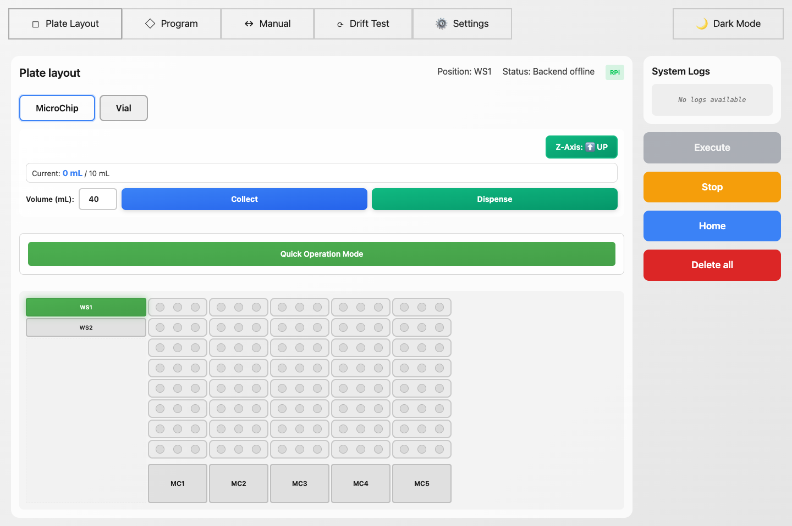

Both layouts include two washing stations (WS1, WS2) on the left side.

The top bar shows the current pipette position (e.g. "Position: WS1"), connection status, and controller type.

Controls along the bottom/side:

- **Z-Axis** -- toggles the pipette arm up or down, showing current state
- **Collect / Dispense** -- enter a volume in mL (default 40) and click to aspirate or dispense; a progress bar shows current pipette volume
- **Right panel** -- Execute, Stop, Home, and Delete All buttons, plus a scrolling log of system events

### Quick operation mode


Click the green "Quick Operation Mode" button to run a single pipetting cycle without building a full program. A 4-step guided workflow appears. The active step pulses blue to show which well to click next:

1. **Pickup** -- click a well to set it as the source. A "P" badge appears on the plate. The step turns green with the well ID.
2. **Dropoff** -- click a destination well. Gets a "D" badge.
3. **Rinse** -- defaults to WS2 (pre-selected with an "R" badge). Click a different well to override.
4. **Wash** -- defaults to WS1 (pre-selected with a "W" badge). Click to override.

A volume field below lets you change the transfer amount (default 40 mL).

Once all four wells are set, the "Execute Operation" button turns blue. Clicking it runs the full cycle: move to pickup, aspirate, move to dropoff, dispense, rinse at WS2, wash at WS1, then home.

Cancel in the top-right exits back to normal mode.

---

## 2. Program

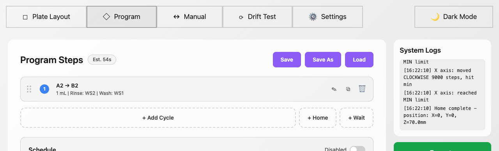

Build multi-step pipetting sequences here. The header shows "Program Steps" with an estimated run duration badge (e.g. "Est. 54s") calculated from motor speeds, well distances, and cycle counts. Three buttons on the right handle saving and loading: **Save**, **Save As**, and **Load**.

Each step appears as a draggable card. In the screenshot, step 1 shows "A2 -> B2" transferring 1 mL with rinse at WS2 and wash at WS1. Each card has edit, duplicate, and delete icons on the right. Drag the dotted handle on the left to reorder steps.

Three buttons below the step list add new steps:

- **+ Add Cycle** -- opens the step wizard (see below)
- **+ Home** -- adds a step that returns all axes to home position
- **+ Wait** -- adds a timed pause

### Step types

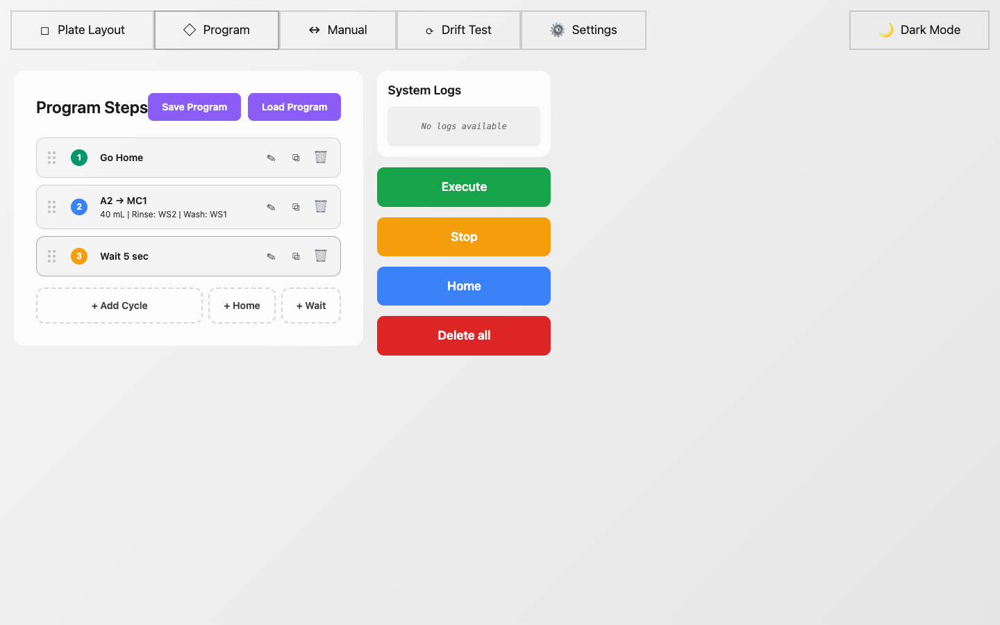

Each step card has a colored badge:

- **Green (Home)** -- returns all axes to their starting position. Useful between operations or at the start/end of a program.
- **Blue (Cycle)** -- a full pipetting cycle. The card shows pickup and dropoff wells (e.g. "A2 -> MC1"), transfer volume, and rinse/wash wells.
- **Orange (Wait)** -- pauses for a set duration (e.g. "Wait 5 sec").

### Step wizard


When you click "+ Add Cycle", a 2-stage wizard opens:

**Stage 1 -- Wells and volume:**

- Pickup well (required) -- type a well ID (A2, WS1, MC3) or click "Select from plate" to pick visually
- Dropoff well -- where to dispense
- Rinse well -- defaults to WS2
- Wash well -- defaults to WS1
- Sample volume -- mL to transfer (default 40)

**Stage 2 -- Timing and repetition:**

- Wait time -- seconds to pause between operations
- Repetition mode -- "By Quantity" (repeat N times) or "By Time Frequency" (repeat at an interval over a total duration)

### Program management

- **Save** -- saves steps and schedule to `scheduled_program.json`. Auto-save also runs on every change, so you rarely need to click this manually.
- **Save As** -- type a name and save a copy to the `programs/` directory. Useful for keeping multiple program variants.
- **Load** -- opens a list of previously saved programs. Each entry has load, download (as JSON), and delete buttons.

### Schedule

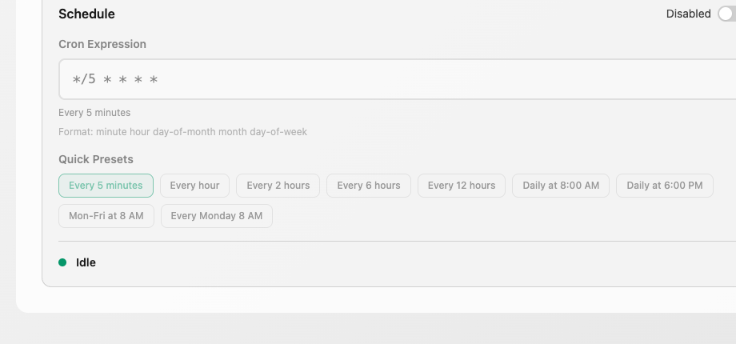

The Schedule section sits below the step list. This is how you set up unattended, repeating execution of your program.

**Enabled / Disabled toggle** -- the switch in the top-right corner of the Schedule box. When you flip it, the change saves immediately to `scheduled_program.json`. The scheduler (`run_program.py`) reads this flag every time it's called -- if disabled, it skips execution and exits. You can disable a schedule from the UI without stopping `schedule_work.py`.

**Cron Expression** -- a standard 5-field cron expression that controls when the program runs. The five fields are:

```
minute  hour  day-of-month  month  day-of-week
```

For example, `*/5 * * * *` means "every 5 minutes". A human-readable description appears below the input (e.g. "Every 5 minutes") so you can verify you typed it correctly. The format hint underneath reminds you of the field order.

**Quick Presets** -- buttons that fill in the cron expression for you. The available presets are:

| Preset | Cron expression | Meaning |
|--------|----------------|---------|
| Every 5 minutes | `*/5 * * * *` | Runs at :00, :05, :10, :15, ... every hour |
| Every hour | `0 * * * *` | Runs at the top of every hour |
| Every 2 hours | `0 */2 * * *` | Runs at :00 every 2 hours |
| Every 6 hours | `0 */6 * * *` | Runs 4 times a day (midnight, 6 AM, noon, 6 PM) |
| Every 12 hours | `0 */12 * * *` | Runs twice a day (midnight and noon) |
| Daily at 8:00 AM | `0 8 * * *` | Once a day at 8 AM |
| Daily at 6:00 PM | `0 18 * * *` | Once a day at 6 PM |
| Mon-Fri at 8 AM | `0 8 * * 1-5` | Weekdays only at 8 AM |
| Every Monday 8 AM | `0 8 * * 1` | Once a week on Monday at 8 AM |

The currently active preset is highlighted in green. You can also type any valid cron expression manually.

**Execution status** -- at the bottom of the Schedule box, a colored dot shows the current state:

- Green dot + "Idle" -- no program is running right now
- Amber dot + "Running" -- a program is currently executing (shows step progress, e.g. "Step 3 of 7")
- Red dot + "Error" -- the last run failed (shows error message)

This status updates whether the program was started from the UI's Execute button or triggered by the scheduler. The last run timestamp also appears here after a completed run.

### How scheduling works end-to-end

1. Add your steps in the Program tab
2. Set a cron expression (or pick a preset)
3. Flip the toggle to "Enabled"
4. On the Raspberry Pi, start the scheduler: `python schedule_work.py`
5. Every 60 seconds, `schedule_work.py` calls `run_program.py`
6. `run_program.py` reads `scheduled_program.json`, checks `schedule.enabled` is true, checks the cron expression matches the current minute, and only then sends the steps to the FastAPI server for execution
7. To pause: flip the toggle to "Disabled" in the UI. The scheduler keeps running but `run_program.py` skips execution until you re-enable it

---

## 3. Manual


Direct motor control for calibration and troubleshooting. Each axis (X, Y, Z, Pipette) gets its own card showing:

- Current position in mm (or mL for the pipette)
- A step count input (default 100 steps)
- Orange (-) and green (+) buttons to move that motor by the specified steps

"Set Current Position" lets you override the tracked position without moving anything. Useful after a manual adjustment or to re-zero.

The bottom bar shows current well position and backend connection status.

---

## 4. Drift test

The drift test measures how accurately a stepper motor returns to the same position after repeated back-and-forth travel. This helps identify mechanical issues like backlash, missed steps, or belt slippage before they affect real pipetting runs.

### Setup

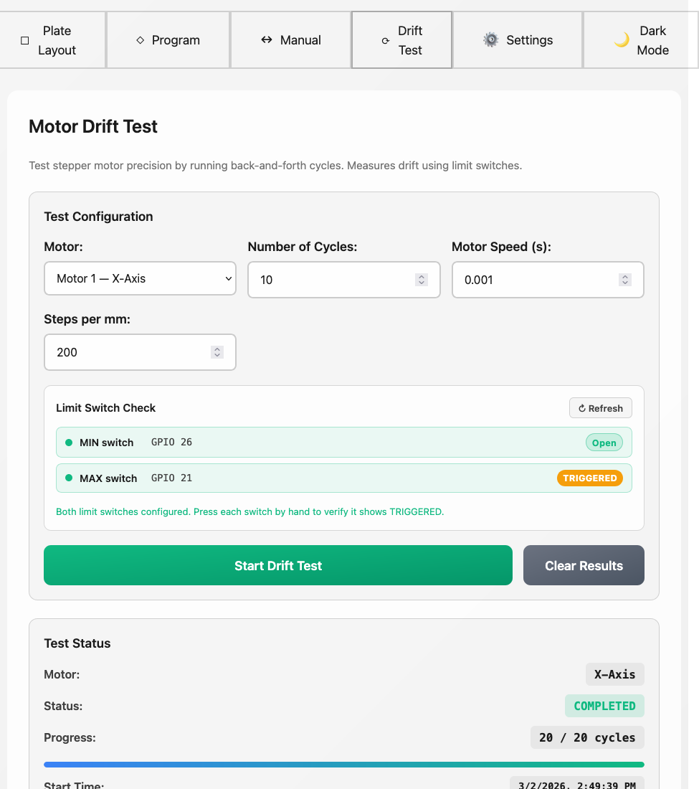

At the top, select the motor to test and fill in the parameters:

- **Motor** -- dropdown to pick Motor 1 (X), Motor 2 (Y), Motor 3 (Z), or Motor 4 (Pipette)
- **Number of Cycles** -- how many round trips to run (default 10)
- **Motor Speed (s)** -- delay between steps in seconds (default 0.001). Lower values = faster movement.
- **Steps per mm** -- conversion factor used to translate step counts into mm for the charts

The Limit Switch Check panel shows the MIN and MAX switch states for the selected motor (e.g. GPIO 26 = Open, GPIO 21 = TRIGGERED). Click Refresh to update. Press each switch by hand to verify it reads TRIGGERED before running a test.

Click "Start Drift Test" to begin. A progress bar tracks completion (e.g. "20 / 20 cycles"). The Test Status box below shows the motor name, status (COMPLETED/RUNNING), and start/end timestamps. "Clear Results" wipes previous data.

### Test results

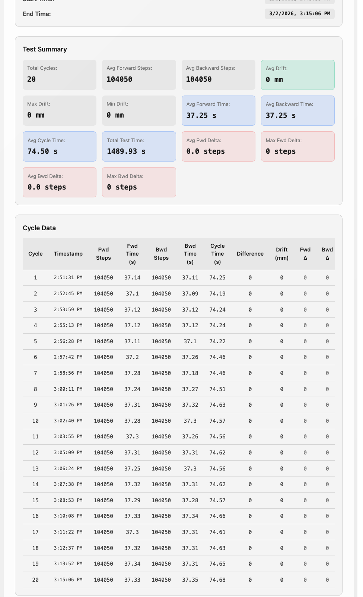

After the test completes, results appear in two sections:

**Test Summary** -- a table with the key numbers:

- Forward/backward step counts (min, max, average)
- Average forward and backward time per pass
- Average cycle time and peak cycle time
- Total drift in steps and mm
- Average drift per cycle and max single-cycle drift

**Cycle Data** -- one row per cycle showing: timestamp, forward steps, forward time, backward steps, backward time, cycle time, step difference, drift in mm, and cumulative forward/backward deltas.

### Charts

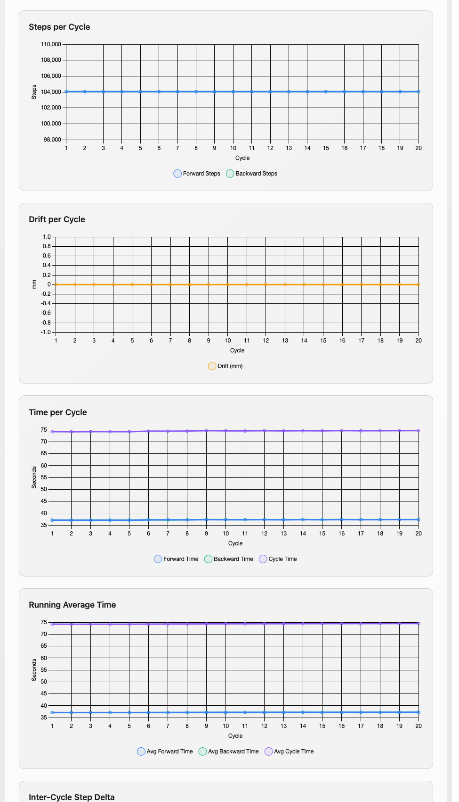

- **Steps per Cycle** -- forward and backward step counts overlaid. Both lines should sit flat and close together. Any separation means one direction consistently takes more steps than the other.
- **Drift per Cycle** -- cumulative drift in mm. A flat line at zero is ideal. A steadily rising or falling line means the motor consistently overshoots or undershoots in one direction.
- **Time per Cycle** -- forward time, backward time, and total cycle time. The forward and backward passes should take roughly the same time. Large differences may indicate binding in one direction.
- **Running Average Time** -- smoothed version of the timing chart. Helps spot gradual slowdowns that are hard to see cycle-by-cycle.

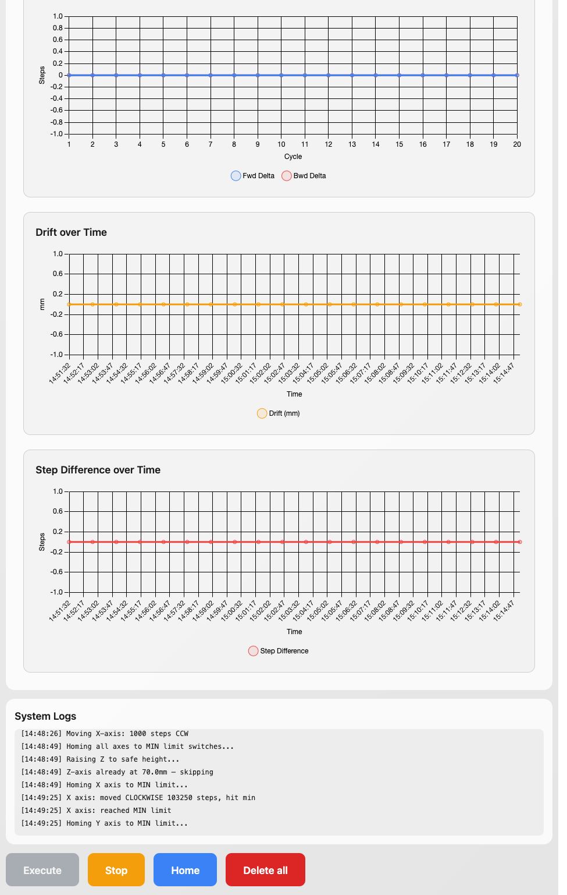

- **Inter-Cycle Step Delta** -- forward and backward step deltas between consecutive cycles. Should hover near zero. Spikes mean the motor suddenly traveled more or fewer steps than the previous cycle.
- **Drift over Time** -- drift in mm plotted against wall-clock timestamps. Same data as "Drift per Cycle" but on a time axis, so you can correlate drift with how long the test has been running.
- **Step Difference over Time** -- per-cycle step difference (forward minus backward) against timestamps. A flat line near zero means the motor is balanced in both directions.

The System Logs panel at the bottom shows the raw motor commands and homing sequences for debugging.

### What to look for

- Flat lines across all charts = the motor is accurate and repeatable.
- Gradual trends in the drift chart = systematic error. Check belt tension or driver microstepping settings.
- Random spikes in cycle differences = mechanical binding, loose couplings, or electrical noise.
- Large total drift relative to cycle count = the system won't hold position over long programs. Recalibrate or inspect the mechanical assembly.

---

## 5. Settings

The Settings tab has three sub-tabs: Coordinate Mapping, Motor Settings, and Calibration. All changes save to `config.json` and apply immediately without a server restart.

### Coordinate mapping

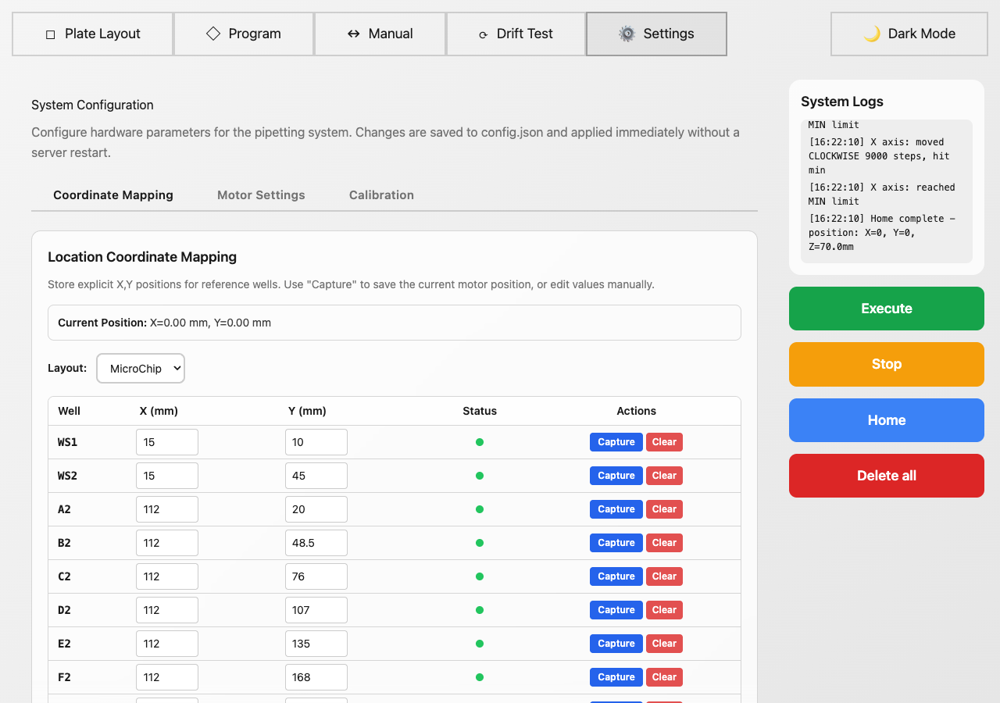

This is where you tell the system where each well is located in physical space. A table lists all reference wells for the selected layout (MicroChip or Vial) with X and Y coordinate columns in mm.

At the top, "Current Position" shows the real-time motor X,Y coordinates. Use the Layout dropdown to switch between MicroChip and Vial.

Each row has:
- Well name (WS1, WS2, A2, B2, MC1, etc.)
- X and Y fields you can type into directly
- A green dot in the Status column when coordinates are set
- **Capture** -- saves the current motor position as that well's coordinates. Move the pipette to the well using Manual mode first, then click Capture.
- **Clear** -- removes the saved coordinates for that well

### Motor settings

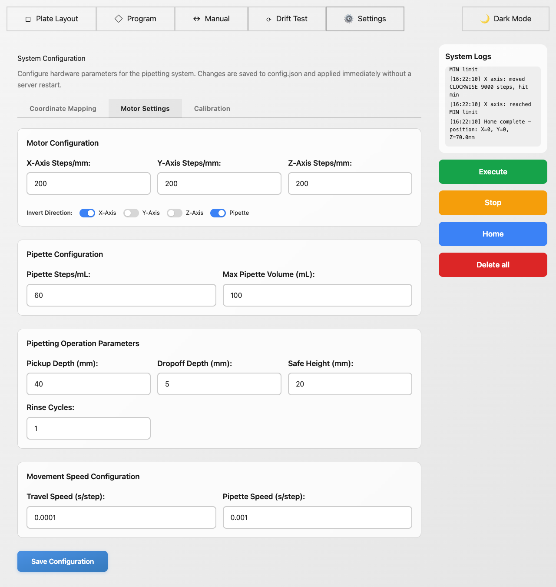

Four configuration sections:

**Motor Configuration** -- steps per mm for the X, Y, and Z axes (default 200 each). Below that, inversion toggles for each axis and the pipette. Flip these if a motor moves the wrong direction.

**Pipette Configuration** -- steps per mL (default 60) and maximum pipette volume in mL (default 100).

**Pipetting Operation Parameters** -- pickup depth (how far Z goes down to aspirate, default 40 mm), dropoff depth (how far Z goes down to dispense, default 5 mm), safe height (Z clearance during XY moves, default 20 mm), and rinse cycles (how many aspirate/dispense cycles per rinse, default 1).

**Movement Speed Configuration** -- travel speed in seconds per step (default 0.0001s, lower = faster) and pipette speed in seconds per step (default 0.001s, slower for precision).

Click "Save Configuration" at the bottom to write all changes to `config.json`.

### Calibration

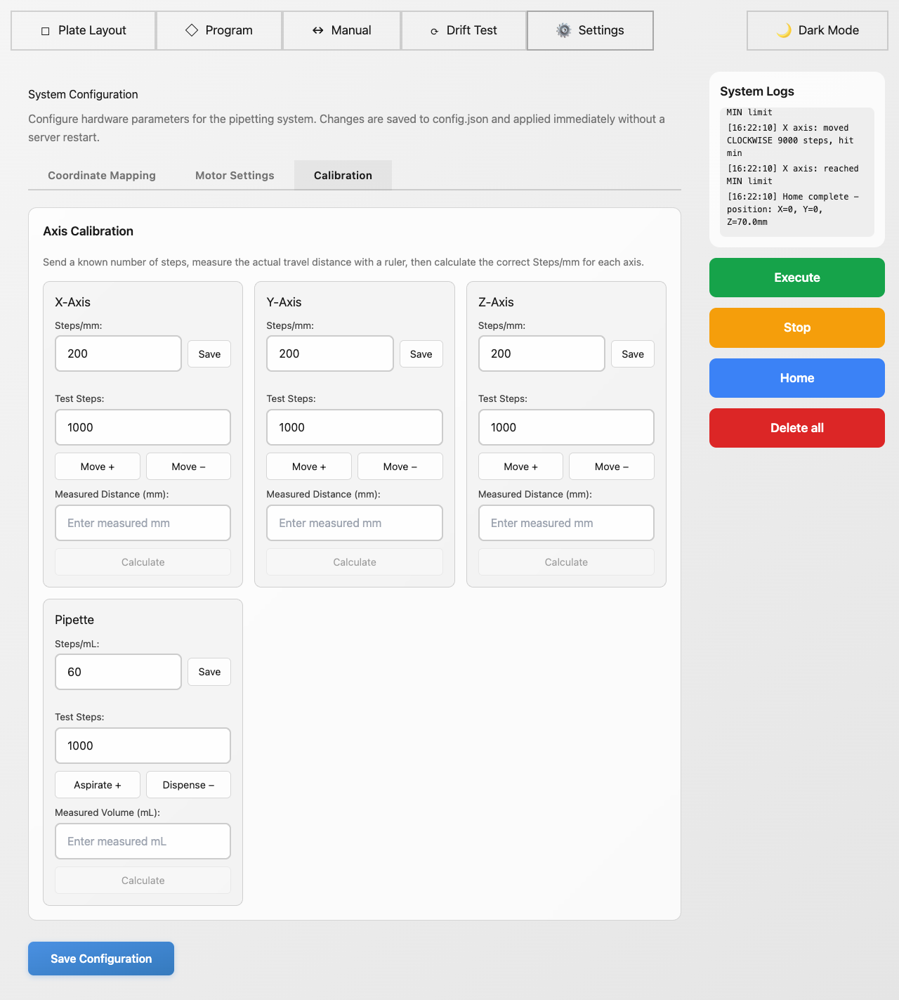

Each axis (X, Y, Z) and the pipette gets its own calibration card. The process for each:

1. Note the current Steps/mm value at the top of the card
2. Enter a test step count (default 1000)
3. Click "Move +" or "Move -" to send that many steps to the motor
4. Measure the actual distance traveled with a ruler (or volume with a graduated cylinder for the pipette)
5. Enter the measured value in "Measured Distance (mm)" (or "Measured Volume (mL)" for the pipette)
6. Click "Calculate" -- the system computes the correct steps-per-mm (or steps-per-mL) value
7. Click "Save" to apply the new value

The pipette card works the same way but uses "Aspirate +" and "Dispense -" buttons instead of Move, and measures volume in mL instead of distance.

---

## Typical workflow

1. **Home** -- click Home to move all axes to starting positions
2. **Calibrate** (first time only) -- go to Settings > Coordinate Mapping, use Manual mode to position over each reference well, click Capture
3. **Build a program** -- go to the Program tab, add cycle/home/wait steps
4. **Run it** -- click Execute. Watch progress in the logs panel. The Plate Layout tab shows which well the system is working on.
5. **Schedule it** (optional) -- enable the schedule, pick a cron expression, then run `python schedule_work.py` on the Pi
6. **Stop** -- click Stop at any time to halt execution
